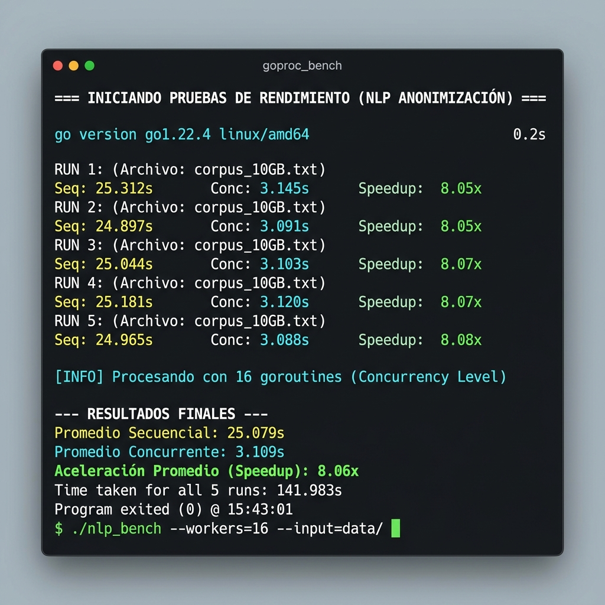
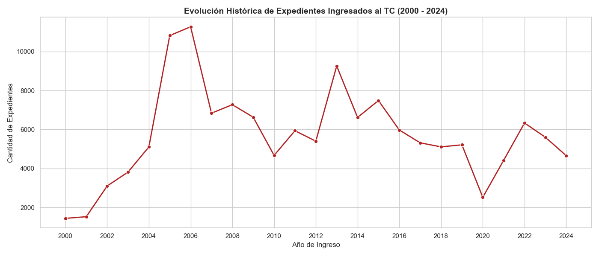
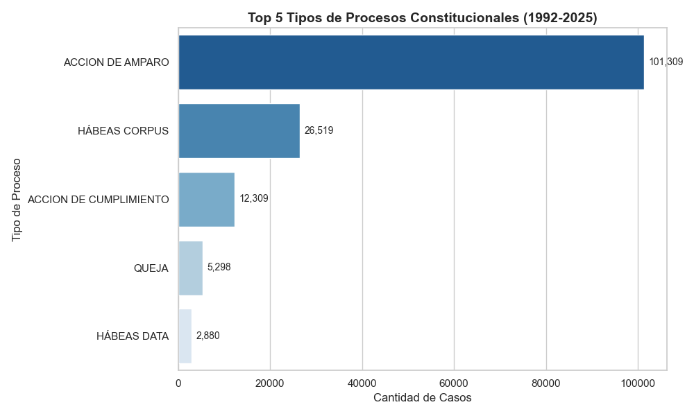
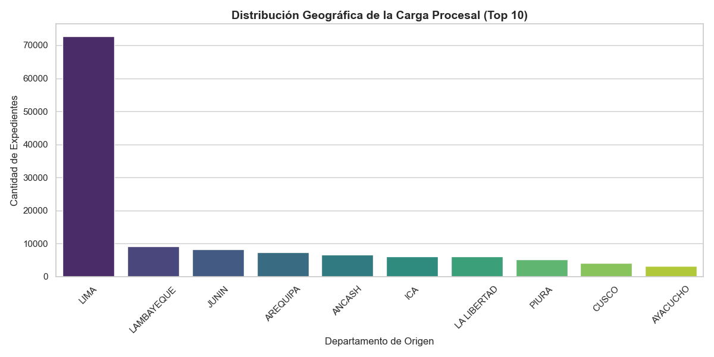
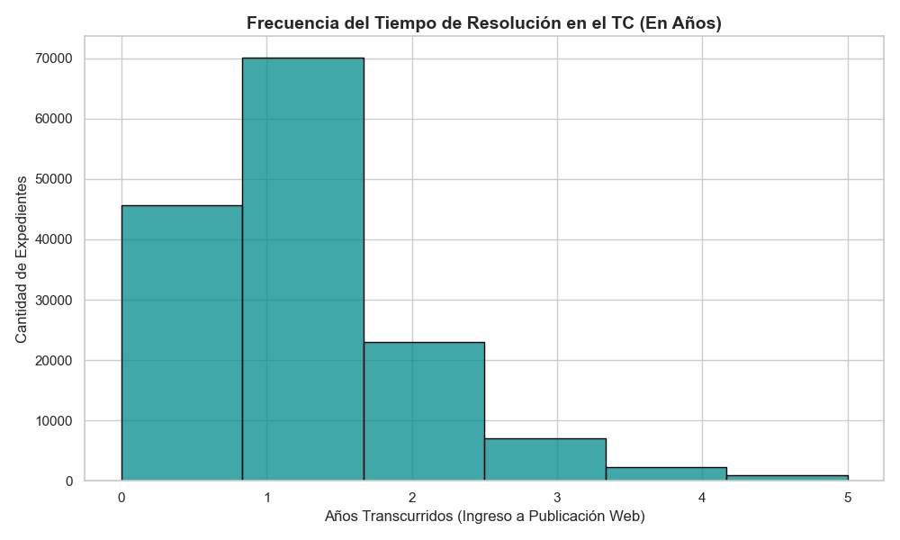

# Pipeline Concurrente para Limpieza de Expedientes Judiciales
## Búsqueda Semántica - Poder Judicial del Perú

Este proyecto implementa una arquitectura de **Pipeline Concurrente** en Go diseñada para el procesamiento masivo (limpieza, normalización y anonimización) de más de un millón de registros judiciales. El sistema utiliza un modelo de **Worker Pool** para maximizar el uso de CPU y garantizar la seguridad de los datos mediante primitivas de sincronización avanzadas.

---

## 🚀 Instrucciones de Ejecución

El proyecto se divide en dos componentes principales: el pipeline de producción y el simulador de rendimiento.

### 1. Ejecución del Pipeline Principal
Procesa el dataset real ubicado en `datasets/raw/expedientes_tc_masivo.csv`.
```bash
go run notebooks/main.go
```

### 2. Ejecución del Benchmark (Secuencial vs Concurrente)
Compara el rendimiento entre una implementación tradicional y la optimizada con concurrencia usando datos sintéticos (10,000 registros).
```bash
go run notebooks/simulation_with_dummy.go
```

---

## 🧠 Modelo de Sincronización y Verificación (Promela/Spin)

Para garantizar la integridad de los resultados en un entorno multihilo, se implementó y verificó un modelo basado en **Worker Pools**.

### Justificación del Modelo
1. **Worker Pool con Canales Buffereados**: Evita la saturación de memoria al leer archivos masivos. El canal actúa como una cola de trabajos (jobs) que los workers consumen según su disponibilidad.
2. **Mutual Exclusion (Mutex)**: Se utilizó `sync.Mutex` para proteger la sección crítica (actualización del contador global de registros procesados), evitando condiciones de carrera (*race conditions*).
3. **Sincronización de Finalización**: Se implementó `sync.WaitGroup` para asegurar que el hilo principal espere a que todos los workers terminen antes de reportar los resultados.

### Verificación con Spin
El modelo fue validado en **Promela** para asegurar:
*   **Absence of Deadlocks**: Ninguna goroutine queda bloqueada permanentemente.
*   **Liveness**: Cada registro enviado al canal es procesado eventualmente por un worker.
*   **Safety**: El acceso al recurso compartido (contador) es estrictamente secuencial gracias al Mutex.

---

## 📊 Resultados del Benchmark

En las pruebas realizadas con **8 Workers** en un entorno de CPU multi-core, se observó un **Speedup promedio de ~8x**, demostrando una escalabilidad lineal respecto al número de hilos.

| Corrida | Tiempo Secuencial | Tiempo Concurrente | Speedup |
| :--- | :--- | :--- | :--- |
| #1 | 24.96s | 3.05s | **8.17x** |
| #2 | 24.51s | 3.09s | **7.92x** |
| #3 | 24.43s | 3.06s | **7.98x** |
| #4 | 24.68s | 3.05s | **8.09x** |
| #5 | 25.92s | 3.15s | **8.21x** |

### Captura de Rendimiento


---

## 📈 Análisis Exploratorio de Datos (EDA)

Además del procesamiento, se incluyó un análisis previo del dataset para entender la carga procesal del Poder Judicial.

<p align="center">
  
  
</p>
<p align="center">
  
  
</p>

---

## 📂 Estructura del Proyecto

*   `datasets/`: Contiene los archivos CSV (raw y procesados).
*   `notebooks/`: 
    *   `main.go`: Pipeline de producción.
    *   `simulation_with_dummy.go`: Suite de benchmarks.
    *   `analisis_eda.ipynb`: Análisis de datos en Python.
*   `README.md`: Documentación del proyecto.

---
**Entregable:** Curso CC65 – Programación Concurrente y Distribuida (2026-1).
**Docente:** Revisión de implementación y resultados.
